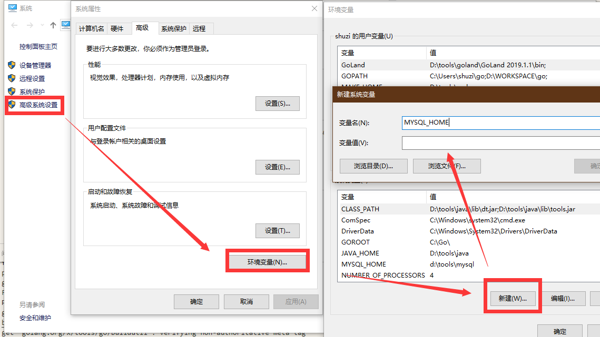

# Windows下安装配置Mysql

* 下载

    下载Mysql5.7 zip压缩包[MySQL Community Server 5.7.26](https://dev.mysql.com/downloads/mysql/5.7.html#downloads)

* 解压
  
  解压到合适的位置，比如 D:\server\mysql

* 添加环境变量
  
  我的电脑->属性->高级系统设置->环境变量

  
  
  添加两个变量：
  > MYSQL_HOME D:\server\mysql

  > PATH D:\server\mysql\bin

  或使用**管理员权限**打开 CMD，使用如下命令：

  ```bat
  SETX /M MYSQL_HOME D:\server\mysql
  SETX /M PATH  D:\server\mysql\bin
  ```
  查看变量是否生效：

  ```bat
  ECHO %MYSQL_HOME%

  ECHO %PATH% |FINDSTR "mysql"
  ```

* Mysql初始化
  
  配置mysql配置文件 %MYSQL_HOME%\bin\my.ini

  ```conf
  [mysqld]
  #Mysql 端口
  port = 3306
  # Mysql Home
  basedir =d:\server\mysql
  # 数据目录
  datadir=d:\server\mysql\data
  # 其它配置项请参考Mysql用户手册


  ```
  Mysql 初始化
  ```bat
  mysqld --initialize-insecure
  mysqld --install
  net start mysql
  ```
  设置密码
  ```sql
  mysql -u root 
  show databases;
  use mysql
  set password=password('123456')
  flush privileges;
  quit
  ```